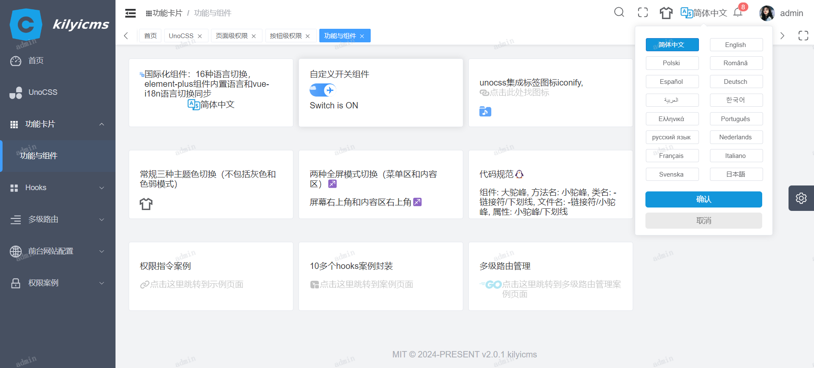
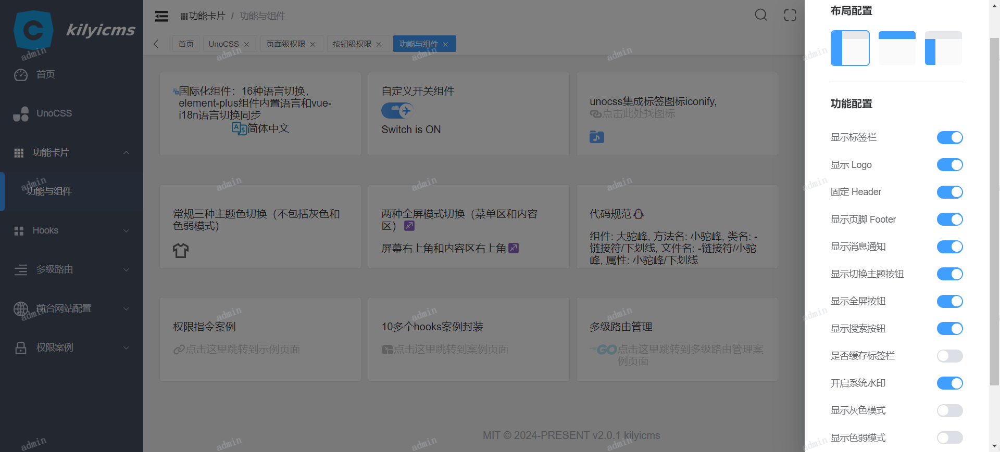

<div align="center">
  
  <h1>Kilyicms</h1>
  <span>English | <a href="./README.zh-CN.md">中文</a></span>
</div>

## ⚡ Introduction

Kilyicms is a front-end and back-end separation/open source management system base solution , based on Vue3.5+, TypeScript, Element Plus, Pinia and Vite5.4+ and other mainstream technologies , support for 16 language switching . Functional modules in the continuous improvement ...

## 📺 Online Preview

| Location            | Account       | Link                                 |
| ------------------- | ------------- | ------------------------------------ |
| vercel/github-pages | admin or user | [Link](https://kilyicms.vercel.app/) |

## ❤️ Powered by Love

- **Completely free**: But we hope you'll give it a star!!!
- **Very simple**: No complex encapsulations, no complicated type gymnastics, ready to use.
- **Detailed comments**: Each configuration item has as detailed comments as possible.
- **Latest dependencies**: Regular updates to all third-party dependencies to the latest version.
- **Organized code**: Unified code style, naming conventions, and comment style.

## 🧭character

- **Vue3**: Uses the latest Vue3 Composition API with script setup.
- **Element Plus**: The Vue3 version of Element UI.
- **Pinia**: The so-called Vuex5.
- **Vite**: It's really fast.
- **Vue Router**: Routing functionality.
- **TypeScript**: A superset of JavaScript.
- **PNPM**: A faster and disk space-saving package manager.
- **Scss**: Consistent with Element Plus.
- **CSS Variables**: Mainly controls the layout and color of the project.
- **ESlint**: Code linting.
- **Prettier**: Code formatting.
- **Vue-i18n**：Simple, powerful international plugin.
- **Axios**: Handles network requests (already encapsulated).
- **UnoCSS**: A high-performance, highly flexible, on-demand atomic CSS engine.
- **Mobile Compatibility**: Layouts compatible with mobile device resolutions.

## ✨Features

- **User Management**: Login, logout demo.
- **Permission Management**: Page-level permissions (dynamic routes), button-level permissions (directive permissions, permission functions), route guards.
- **Multiple Environments**: Development (development), testing (test), production (production).
- **Multiple Themes**: Light, dark, deep blue; three theme modes.
- **Multiple Layouts**: Left sidebar, top bar, mixed layout; three layout modes.
- **Multi-language**: 16 language switches, synchronization between built-in languages of element-plus components and vue-i18n language switches.
- **Error Pages**: 403, 404 error pages.
- **Dashboard**: Displays different dashboards based on different users.
- **Other Built-in Features**: SVG support, dynamic sidebar, dynamic breadcrumbs, tab navigation, screen full-screen mode, adaptive collapsed sidebar, hooks (Composables).

#### 🎈Marked as Completed, Others as Pending

###### Frontend Completed: Hooks, Components, Directives, Configuration

1. Global SVG component encapsulation - usability (vite configuration) 🎈
2. Project theme switching (light/dark/dark-blue) with UI component library support 🎈
3. Three environment configurations (development, testing, production) 🎈
4. Button debounce (prevent rapid clicks) 🎈
5. Encapsulate requests to avoid multiple invalid requests (add throttling checksums) 🎈
6. Two full-screen mode switching (menu area and content area)🎈
7. Enable debugging in production environment - encapsulated hooks - 🎈
8. Backend Permissions, Routing Permissions, Page Permissions, Button Permissions 🎈
9. Optimization of right mouse button management in background tabs🎈
10. Login userName watermark settings, local and global watermark case demo🎈
11. Upload Excel sheet + parsing + printing
12. PDF preview + printing
13. Rich text dynamic content editing + image upload + video upload
14. Global custom skeleton screen animation loading component wrapper
15. Page Load Progress Bar Component Wrapper 🎈
16. Request loading encapsulation (two types: hooks 🎈, encapsulation in request method for global loading animation 🎈)
17. Necessary component global registration 🎈
18. Multi-language management, multi-language switching components, element-plus built-in language synchronization switching, batch translation program writing 🎈
19. Front-end routing separation, arbitrary routing, constant routing, asynchronous routing 🎈
20. Integrated label iconify with unocss 🎈
21. Custom directive global encapsulation (currently permission directive) 🎈
22. Frontend code automated Jenkins deployment or deployment via Node.js CLI
23. Three types of captcha validation (frontend component, frontend-backend numeric or graphical captcha validation, frontend-backend Cloudflare browser fingerprint automatic CAPTCHA)
24. Large file chunk upload (standalone upload, upload in rich text user)
25. Micro-frontend architecture construction, dynamic route addition, dynamic subsystem addition, properly handle CSS sandboxing

###### Backend Completed:

1. Modular development 🎈
2. Permission control
3. Login JWT validation 🎈
4. Two types of captcha validation (frontend-backend numeric or graphical captcha validation, frontend-backend Cloudflare browser fingerprint CAPTCHA), automatically push messages to frontend after a certain time
5. Sensitive information encryption (password + address... using RSA encryption library as a reference)
6. Redis rate limiting
7. Jenkins automated deployment
8. Docker
9. Backend multi-language switching based on frontend requests

## 🚀 Development

#### Project Installation

Ensure that you have installed Node.js and npm (or use pnpm/yarn). Then run the following commands to install the project dependencies:

#### 🎇Fetch the Project Code

```js
git clone https://github.com/durunsong/kilyicms.git
cd kilyicms (Frontend project)
cd server (Backend project)
```

```
# Setup

1. Install the recommended plugins from the .vscode directory.
2. Node version 18.x or 20+
3. PNPM version 8.x or latest version

# Clone the project

git clone https://github.com/durunsong/kilyicms

# Enter the project directory

cd kilyicms

# Install dependencies

pnpm i

# Start the development server

pnpm run dev
```

## ✔️ Preview

```pnpm
# Preview the test environment

pnpm preview:test

# Preview the production environment

pnpm preview:prod
```

## 📦️ Multi-environment Packaging

```pnpm
# Build the test environment

pnpm build:test

# Build the production environment

pnpm build:prod
```

## 🔧 Code Check

```pnpm
# Code formatting

pnpm lint
```

## 🎉Git Commit Guidelines

- `feat` Add new business functionality
- `fix` Fix business issues/bugs
- `perf` Optimize performance
- `style` Change code style, no impact on functionality
- `refactor` Refactor code
- `revert` Revert changes
- `test` Test-related changes, no business logic changes
- `docs` Documentation and comment-related changes
- `chore` Update dependencies/modify scaffold configuration and other trivial tasks
- `workflow` Workflow improvements
- `ci` Continuous integration-related changes
- `types` Type definition file changes
- `wip` Work in progress
- `delete` deletes an obligation code

## 🌄Project Preview





## 💕 Thanks for the Star

It's not easy to get stars for a small project. If you like this project, feel free to support it with a star! This is the only motivation for the author to keep maintaining it (whisper: after all, it's free).

Let me know if you need any modifications!
