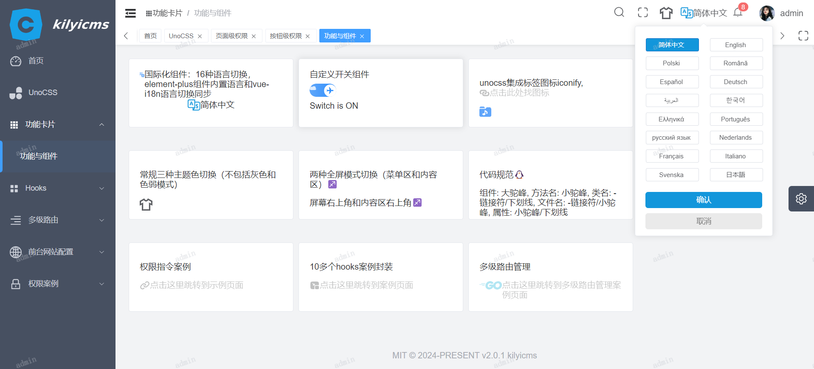
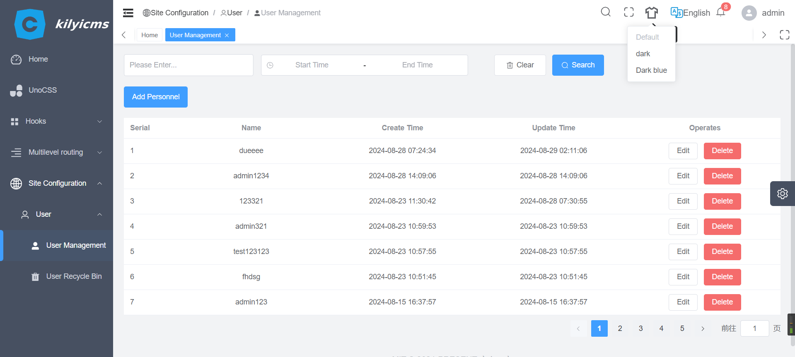
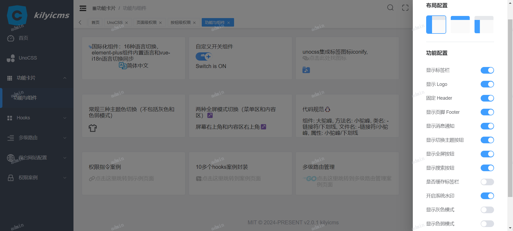

<div align="center">
  
  <h1>Kilyicms</h1>
  <span><a href="./README.md">English</a> | 中文</span>
</div>

## ⚡ 简介

Kilyicms 是一个前后端分离/开源的中后台管理系统基础解决方案，基于 Vue3.5+、TypeScript、Element Plus、Pinia 和 Vite5.4+ 等主流技术,支持16种语言切换。功能模块在持续完善中...

## 📺 在线预览

| 位置                | 账号          | 链接                                 |
| ------------------- | ------------- | ------------------------------------ |
| vercel/github-pages | admin 或 user | [链接](https://kilyicms.vercel.app/) |

## ❤️ 用爱发电

- **目前这个框架免费**：但希望你点一个 star ！！！
- **非常简洁**：没有复杂的封装，没有复杂的类型体操，开箱即用
- **详细的注释**：各个配置项都写有尽可能详细的注释
- **最新的依赖**: 定期更新所有三方依赖至最新版
- **有一点规整**: 代码风格统一，命名风格统一，注释风格统一
- **有一点规整**:如需版权完整代码，联系WX：DU2603948701

## 🧭特性

- **Vue3**：采用 Vue3 + script setup 最新的 Vue3 组合式 API
- **Element Plus**：Element UI 的 Vue3 版本
- **Pinia**: 传说中的 Vuex5
- **Vite**：真的很快
- **Vue Router**：路由路由
- **TypeScript**：JavaScript 语言的超集
- **PNPM**：更快速的，节省磁盘空间的包管理工具
- **Scss**：和 Element Plus 保持一致
- **CSS 变量**：主要控制项目的布局和颜色
- **ESlint**：代码校验
- **Prettier**：代码格式化
- **Vue-i18n**：简单、强大的国际化插件
- **Axios**：发送网络请求（已封装好）
- **UnoCSS**：具有高性能且极具灵活性的即时原子化 CSS 引擎
- **兼容移动端**: 布局兼容移动端页面分辨率

## ✨功能

- **用户管理**：登录、登出演示
- **权限管理**：页面级权限（动态路由）、按钮级权限（指令权限、权限函数）、路由守卫
- **多环境**：开发环境（development）、测试环境(test)、正式环境（production）
- **多主题**：普通、黑暗、深蓝, 三种主题模式
- **多布局**：左侧、顶部、混合, 三种布局模式
- **多语言**: 16种语言切换,element-plus组件内置语言和vue-i18n语言切换同步
- **错误页面**: 403、404
- **Dashboard**：根据不同用户显示不同的 Dashboard 页面
- **其他内置功能**：SVG、动态侧边栏、动态面包屑、标签页快捷导航、Screenfull 全屏、自适应收缩侧边栏、Hook（Composables）

#### 🎈标记为已经完成的功能，其他为待完成的功能

###### 前端完成：hooks 组件 指令 配置

1. 全局 svg组件封装 可用性 (vite配置) 🎈
2. 项目light/dark/dark-blue三种主题切换 配合所依赖的ui组件库🎈
3. 三个环境配置(开发、测试、生产) 🎈
4. 按钮时效(按钮防抖)🎈
5. 封装请求，避免多次无效请求(添加节流校验) 🎈
6. 两种全屏模式切换(菜单区和内容区) 🎈
7. 生产环境是否让用户启用调试功能----封装hooks--- 🎈
8. 后台权限,路由权限，页面权限，按钮权限 🎈
9. 后台标签页鼠标右键管理优化 🎈
10. 登陆者userName水印设置，局部和全局水印案例演示 🎈
11. 上传execl表格+解析+打印
12. PDF预览++打印
13. 富文本动态编辑前台内容+上传图片+上传视频
14. 全局自定义骨架屏动画加载组件封装
15. 页面加载进度条组件封装 🎈
16. 请求loading封装(两种种形式:hooks🎈,封装请求方法里面配置页面加载动画全局封装🎈)
17. 必要组件全局挂载 🎈
18. 多语言管理，多语言切换组件，element-plus内置语言同步切换，批量翻译程序编写 🎈
19. 前端路由分离，任意路由，常量路由，异步路由🎈
20. 集成标签图标iconify配合unocss 🎈
21. 自定义指令全局封装(目前有权限指令) 🎈
22. 前端代码自动化Jenkins部署或通过nodejs命令行部署
23. 三种验证码校验(前端组件方式、前端后端数字运算或图形验证码校验、前端后端cf浏览器指纹自动人机校验)
24. 大文件分片上传(单独上传、富文本上传)
25. 构建微前端架构，动态添加路由，动态添加子系统，处理好css沙箱

###### 后端完成方式 ：

1. 模块化开发🎈
2. 权限控制
3. 登录jwt验证 🎈
4. 两种验证码校验(前端后端数字运算或图形验证码校验、前端后端cf浏览器指纹自动人机校验)，一段时间自动推送消息给前端
5. 敏感信息加密(密码+地址... 参考RSA加密库)
6. Redis限流处理
7. Jenkins自动化部署
8. docker
9. 后端多语言根据前端请求进行切换

## 🚀 开发

#### 项目安装

确保你已经安装了 Node.js 和 npm（或者使用 pnpm/yarn）。然后运行以下命令安装项目的依赖项：

#### 获取项目代码

```js
git clone https://github.com/durunsong/kilyicms.git
cd kilyicms (前端项目)
cd server (后端项目)
```

```bash
# 配置
1. 一键安装 .vscode 目录中推荐的插件
2. node 版本 18.x 或 20+
3. pnpm 版本 8.x 或最新版

# 克隆项目
git clone https://github.com/durunsong/kilyicms

# 进入项目目录
cd kilyicms

# 安装依赖
pnpm i

# 启动服务
pnpm run dev
```

## ✔️ 预览

```bash
# 预览测试环境
pnpm preview:test

# 预览正式环境
pnpm preview:prod
```

## 📦️ 多环境打包

```bash
# 构建测试发布环境
pnpm build:test

# 构建正式环境
pnpm build:prod
```

## 🔧 代码检查

```bash
# 代码格式化
pnpm lint

# 单元测试
pnpm test
```

## 🎉Git 提交规范参考

- `feat` 增加新的业务功能
- `fix` 修复业务问题/BUG
- `perf` 优化性能
- `style` 更改代码风格, 不影响运行结果
- `refactor` 重构代码
- `revert` 撤销更改
- `test` 测试相关, 不涉及业务代码的更改
- `docs` 文档和注释相关
- `chore` 更新依赖/修改脚手架配置等琐事
- `workflow` 工作流改进
- `ci` 持续集成相关
- `types` 类型定义文件更改
- `wip` 开发中
- `delete`删除某个义务代码

## 🌄项目预览图





## 🌐国际化多语言自动化翻译程序

#### 准备：百度翻译api---------> appid appkey

#### 代码仓库 (具体看百度翻译api文档)

[点击这里访问我的另一个仓库](https://github.com/durunsong/Baidu-trans.git)

## 💕 感谢 Star

小项目获取 star 不易，如果你喜欢这个项目的话，欢迎支持一个 star！这是作者持续维护的唯一动力（小声：毕竟是免费的）
